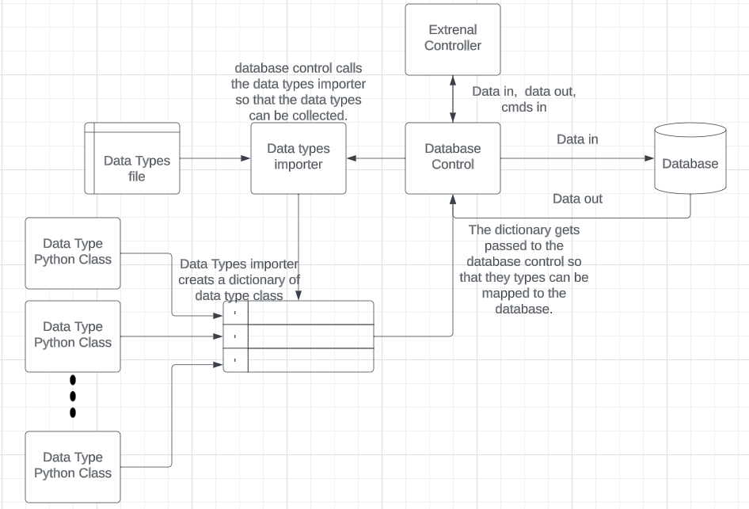

# Database Pythone API
This api is built to adi the user in creating database. It is meant to take and input file, and then translate that into python class that tell the database how to store and access that data. This class also has tools to help interface with the database. It has serval sql commands it knows for creating, storing, and accessing data in the database. The current implemenatation is an `sqllite` database. 



## `databaseControl`
The holds all processed data. It can be query for the the information by the server. It also dynamically creats tales based on data groups in the `dataTypes.dtobj` file.\

### Functions 
1. `__init__` : This function makes a data base, then it goes though all the `dataTypes` collected by the `dataTypesImporter` and creates tables for them in the data base. 

    ```python 
    #make Maps for db creation
    self.__typeMap = { #the point of this dictinary is to map the type names from the dataTypes.dtobj file to 
                        # the sql data base.
        "int" : "INTEGER", 
        "float" : "FLOAT(10)", # NOTE: the (#) is the perscition of the float. 
        "string" : "TEXT",
        "bool" : "BOOLEAN",
        "bigint" : "BIGINT"
    } #  NOTE: this dict makes the .dtobj file syntax match sqlite3 syntax. 
    ```
    The above code is used for mapping the syntax of the `dataTypes.dtobj` file to `sql` syntax.
2. `insertData` : This function takes in a `dataType` and a list of data to insert. After that it mapps it into the data base.
3. `getTablesHTML` : returns the html with all the names of all tables in the data base.
4. `getTables_strLLIST` : returns a list with all the names of all tables in the data base.
5. `getDataType` : returns the data type class that has all the mapping for the data group.
6. `getfeilds` : returns the name of all the data feils in the data group.
7. `getData` : returns a html of all the data rows after a given time. 

## `dataTypes`
This class creeats a data obj that is based on the `dataTypes.dtobj` file. It used in every step of processing the data, from getting it from the bit stream to putting it in the data base, to requesting it from the data base. 

1. `__init__`: this function set up the class. There are three key varibles.

    ```python
    self.__feilds = {} #this dict contains all the data types that will be saved to the data base
    self.__bitMap = []# this list contains info on how to collect the bits from the bit stream. 
    self.__convertMap = {} #this dict contatins types that need to be mapped together. The MSB is the key.  
    ```

    `self.__feilds` is a dictionary of every feild that is present in the data group.
    `self.__bitMap` this is a list of how bits should be pulled out of the bit stream. 
    `self.__converMap` this is a dioctionary of how data feilds should be combined. 
2. `__str__` : returns an html represntation of the `dataType`, it shows the feilds, bit map, and the conver map.
3. All other function are just simple getters and setters. 

## `data importer`
This class takes the `dataTypes.dtobj` file and then turns it into `dataType` classes. That are then passed to `databaseControl`.

### Functions
1. `__init__` : Finds the `dataTypes.dtobj` file. 
2. `pasreDataTypes` : parses the syntax of the `dataTypes.dtobj` file.
3. `getDataTypes` : returns a dictionary of all the create `dataTypes`.
4. `__str__` : returns a html object of all the `dataTypes` that were found from the `dataTypes.dtobj` file.

## `dataTypes.dtobj`

This file defines ALL the data that needs to be pulled out of the bit stream. 

### RULES: #NEEDS UPDATE TO BE EXCEL DRIVEN

1. Any line holding // is ignored. (basically this is how you comment)
2. Any line WITHOUT a tab is consider a data group name, and will be stored into the data base as that name.
3. Any line with a TABS will be consider a data type of the data group above it. These type of lines must have a : and >. \
 The format is `<name of data feild> : <number of bits> > <data type>`. \
 This format is used to collected data from the bit stream then store it into the database.\
 Data feild is the name of the data row to be added to the data base. \
 Number of bits is how many bits are in the bit stream from the sensor. \
 data type is the type that the collected data should be converted to.  
4. any line with # is ignored bits. This is inteded for a header or footer. These lines have the following format. 
 `# : <number of bits igrnored>`.
5. lines that contain the @ are for discontinuos bit streams. This means that bits somewhere else in the bit stream
 that need to be added to this feild. The syntax is: \
 `<name of data feild> : <number of bits> > <data type> @ <MSB feild> < <LSB feild>`\
 `<name of data feild> : <number of bits>` \
NOTE: the first feild in the file can be the MSB or the LSB. \
NOTE: this is consider the same rule 3, it just tells the bit map the bits out of order. \
NOTE: if you are going to do mulpile discontinuos types mapping to the same elment then the intermediate types must have a type cast of NONE. 
6. Data feilds are collected in the order that they appear in the data group. 
7. All feild names in a data group MUST BE unique. 
8. NO inline comments are allowed. 

## Data flow from `dataTypes.dtobj` file to `databaseControl`


## HOW TO
This api is ment to make things as easy as possible. In order to add a new data the user only need to update the excel file that drives the data types and then reimport things into the database. 