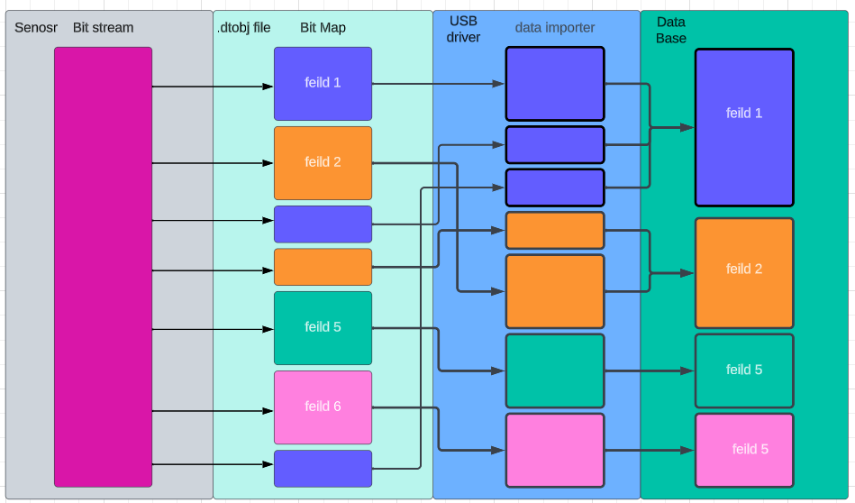

# Database Python API
This api is built to adi the user in creating databases. It is meant to take an input file, and then translate that into a python class that tells the database how to store and access that data. This class also has tools to help interface with the database. It has several sql commands it knows for creating, storing, and accessing data in the database. The current implementation is an `sqllite` database.


# NOTE:
When you are working with the database I recommend clearing the database after you change tables. Use the flowing command. 
```bash
run_ground --clear-database
```
or you can change the database name in the `main.yaml` file. 


## `databaseControl`
The holds all processed data. It can be query for the information by the server. It also dynamically create tables based on data groups in the `dataTypes.dtobj` file.\


### Functions
1. `__init__` : This function makes a database, then it goes through all the `dataTypes` collected by the `dataTypesImporter` and creates tables for them in the database.


    ```python
    #make Maps for db creation
    self.__typeMap = { #the point of this dictionary is to map the type names from the dataTypes.dtobj file to
                        # the sql database.
        "int" : "INTEGER",
        "float" : "FLOAT(10)", # NOTE: the (#) is the prescription of the float.
        "string" : "TEXT",
        "bool" : "BOOLEAN",
        "bigint" : "BIGINT"
    } #  NOTE: this dict makes the .dtobj file syntax match sqlite3 syntax.
    ```
    The above code is used for mapping the syntax of the `dataTypes.dtobj` file to `sql` syntax.
2. `insertData` : This function takes in a `dataType` and a list of data to insert. After that it maps it into the database.
3. `getTablesHTML` : returns the html with all the names of all tables in the database.
4. `getTables_strLIST` : returns a list with all the names of all tables in the database.
5. `getDataType` : returns the data type class that has all the mapping for the data group.
6. `getfields` : returns the name of all the data field in the data group.
7. `getData` : returns a html of all the data rows after a given time.


## `dataTypes`
This class creates a data obj that is based on the `dataTypes.dtobj` file. It is used in every step of processing the data, from getting it from the bit stream to putting it in the database, to requesting it from the database.


1. `__init__`: this function sets up the class. There are three key variables.


    ```python
    self.__felids = {} #this dict contains all the data types that will be saved to the database
    self.__bitMap = []# This list contains info on how to collect the bits from the bit stream.
    self.__convertMap = {} #This dict contains types that need to be mapped together. The MSB is the key.  
    ```


    `self.__felids` is a dictionary of every field that is present in the data group.
    `self.__bitMap` this is a list of how bits should be pulled out of the bit stream.
    `self.__convertMap` this is a dictionary of how data fields should be combined.
2. `__str__` : returns an html representation of the `dataType`, it shows the fields, bitmap, and the convert map.
3. All other functions are just simple getters and setters.


## `data importer`
This class takes the `dataTypes.dtobj` file and then turns it into `dataType` classes. That is then passed to `databaseControl`.


### Functions
1. `__init__` : Finds the `dataTypes.dtobj` file.
2. `parseDataTypes` : parser the syntax of the `dataTypes.dtobj` file.
3. `getDataTypes` : returns a dictionary of all the created `dataTypes`.
4. `__str__` : returns a html object of all the `dataTypes` that were found from the `dataTypes.dtobj` file.


## `dataTypes.dtobj`


This file defines ALL the data that needs to be pulled out of the bit stream.


### RULES:


1. Any line holding // is ignored. (basically this is how you comment)
2. Any line WITHOUT a tab is considered a data group name, and will be stored into the database as that name.
3. Any line with a TABS will be considered a data type of the data group above it. These types of lines must have a : and >. \
 The format is `<name of data field> : <number of bits> > <data type>`. \
 This format is used to collected data from the bit stream then store it into the database.\
 Data field is the name of the data row to be added to the database. \
 Number of bits is how many bits are in the bit stream from the sensor. \
 data type is the type that the collected data should be converted to.  
4. any line with # is ignored. This is intended for a header or footer. These lines have the following format.
 `# : <number of bits ignored>`.
5. lines that contain the @ are for discontinuous bit streams. This means that bits somewhere else in the bit stream
 that needs to be added to this field. The syntax is: \
 `<name of data field> : <number of bits> > <data type> @ <MSB field> < <LSB field>`\
 `<name of data field> : <number of bits>` \
NOTE: the first field in the file can be the MSB or the LSB. \
NOTE: this is considered the same rule 3, it just tells the bitmap the bits out of order. \
NOTE: if you are going to do multiple discontinuous types mapping to the same element then the intermediate types must have a type cast of NONE.
6. Data fields are collected in the order that they appear in the data group.
7. All field names in a data group MUST BE unique.
8. NO inline comments are allowed.


## Data flow from `dataTypes.dtobj` file to `databaseControl`





NOTE: In applications that just want to save 'raw data', just define a single data type that is the same size as the expected bit stream.


## HOW TO
This api is meant to make things as easy as possible. In order to add new data the user only needs to update the .dtobj file that drives the data types and then rerun the code.


## Compiling README.md with pandocs
    To compile .md to a pdf: pandoc -s README.md -V geometry:margin=1in -o README.pdf
    To compile to a stand alone html doc: pandoc  --metadata title="README" -s --self-contained README.md -o README.html


## Linting
This is the method that is used to check the code and make sure it fits coding standards and best practice. The package is called `pylint` and can be installed with \
``` python
    pip install pylint  
```
or
```python
    pip3 install pylint
```
depending on context. The command to run `pylint` is:
```python
    python3 -m pylint --jobs 0 --rcfile .pylintrc <name of python file or folder>
```
